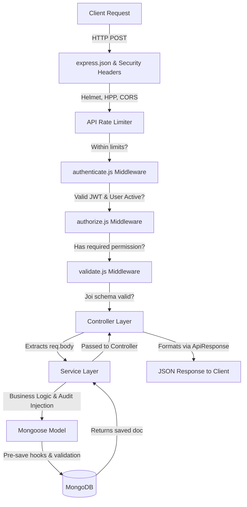

# Finance Dashboard API

[](https://deepwiki.com/Nimishkumar07/Finance-Dashboard-Backend)
[](https://finance-dashboard-backend-mgv1.onrender.com)
[](https://finance-dashboard-backend-mgv1.onrender.com/api-docs)

A production-inspired backend system for a Finance Dashboard application with role-based access control, MongoDB aggregation pipelines, and financial data processing.

> **Built with:** Node.js · Express.js · MongoDB/Mongoose · JWT · Swagger

## 🌐 Live Demo & API Docs
- **Base API Endpoint:** https://finance-dashboard-backend-mgv1.onrender.com
- **System Health Check:** https://finance-dashboard-backend-mgv1.onrender.com/health
- **Interactive API Docs:** https://finance-dashboard-backend-mgv1.onrender.com/api-docs

*(Note: The Render instance spins down after inactivity. The first request may take ~50 seconds to wake up the server).*

---

## 📑 Table of Contents
- [Overview](#-overview)
- [Tech Stack](#-tech-stack)
- [Why This Project Stands Out](#-why-this-project-stands-out)
- [Request Flow](#-request-flow)
- [Architecture](#-architecture)
- [Role-Based Access Control (RBAC)](#-role-based-access-control-rbac)
- [Quick Start](#-quick-start)
- [API Documentation](#-api-documentation)
- [API Usage Examples](#-api-usage-examples)
- [Testing](#-testing)
- [Security Features](#-security-features)
- [Deployment (Render)](#-deployment-render)
- [Data Model](#-data-model)
- [Assumptions & Tradeoffs](#-assumptions--tradeoffs)
- [Available Scripts](#-available-scripts)

---

## 🚀 Overview

A production-inspired backend system for financial data processing with:

- 🔐 Permission-based RBAC (not hardcoded roles)
- 📊 MongoDB aggregation pipelines for analytics
- ⚙️ Layered architecture (routes → services → models)
- 📈 Dashboard APIs (summary, trends, breakdown)
- 🧪 Integration tests + Swagger API docs

Designed to simulate real-world fintech backend systems with focus on scalability, security, and maintainability.

---

## 🛠 Tech Stack

- **Runtime:** Node.js (v18+)  
- **Framework:** Express.js  
- **Database:** MongoDB with Mongoose ODM  
- **Security:** JWT, Helmet, HPP, express-mongo-sanitize  
- **Validation:** Joi  
- **Documentation:** Swagger UI / OpenAPI 3.0  
- **Testing:** Jest & Supertest  
- **Deployment:** Render, MongoDB Atlas  

## ⭐ What Makes This Project Stand Out

Most beginner/intermediate assignments stop at basic CRUD and simple role checks (e.g., `if (role === 'admin')`).  
This project focuses on **real-world backend design patterns**:

### 1. 🔐 Permission-Based RBAC (Not Hardcoded Roles)
Routes are protected using granular permissions like `authorize(PERMISSIONS.CREATE_RECORD)` instead of direct role checks.  
Roles simply map to permission sets.

➡️ Adding or modifying roles requires **no changes to route or controller logic**, making the system flexible and scalable.

---

### 2. 📊 Database-Level Aggregation (Not In-Memory Processing)
All dashboard analytics (totals, trends, breakdowns) are implemented using **MongoDB aggregation pipelines**.

➡️ This avoids loading large datasets into application memory and ensures efficient, single-round-trip computations.

---

### 3. 🧾 Data Integrity with Audit Trails
Financial records are **never hard deleted**.

- Uses `isDeleted` flag
- Tracks `deletedBy` and `deletedAt`
- Automatically excluded via query middleware

➡️ Ensures auditability while preventing accidental data exposure.

---

### 4. 🛡️ Defense-in-Depth Security
Beyond JWT authentication, the system includes:

- `helmet` → secure HTTP headers  
- `hpp` → parameter pollution protection  
- `express-mongo-sanitize` → NoSQL injection prevention  
- Rate limiting → stricter controls on auth routes  

➡️ Demonstrates layered backend security practices.

---

### 5. ⚙️ Consistent API Contracts & Error Handling
- All responses follow a standardized format: `{ success, message, data }`
- Global error handler normalizes Mongoose and validation errors

➡️ Prevents leaking internal details while maintaining clean API responses.
---

## 🔄 Request Flow

`Request` → `Middleware (Auth + RBAC + Validation)` → `Controller` → `Service` → `Database` → `Response`

Below is the exact path a request takes when hitting a protected endpoint (like creating a record):



---

## 🏗 Architecture

```
src/
├── config/          # Environment & database configuration
├── constants/       # Roles, permissions, categories (single source of truth)
├── middleware/      # Auth, RBAC, validation, rate limiting, error handling
├── models/          # Mongoose schemas with indexes & middleware
├── controllers/     # Thin request/response handlers
├── services/        # Core business logic & aggregation pipelines
├── validators/      # Joi request validation schemas
├── routes/          # Express route definitions with Swagger docs
└── utils/           # ApiError, ApiResponse, catchAsync helpers
```

### Design Principles
- **Layered Architecture:** Routes → Controllers → Services → Models
- **Permission-based RBAC:** Access control checks permissions, not role names — making it extensible without code changes
- **Aggregation over application logic:** Dashboard analytics use MongoDB aggregation pipelines for efficiency
- **Soft Delete:** Financial records use soft delete with full audit trail (who deleted, when)
- **Standardized Responses:** Every API response follows the same `{ success, message, data }` shape

---

## 🔐 Role-Based Access Control (RBAC)

### Permission Matrix

| Action | Viewer | Analyst | Admin |
|---|:---:|:---:|:---:|
| View dashboard summary | ✅ | ✅ | ✅ |
| View recent activity | ✅ | ✅ | ✅ |
| View category breakdown | ❌ | ✅ | ✅ |
| View trends & analytics | ❌ | ✅ | ✅ |
| List/view records | ❌ | ✅ | ✅ |
| Create records | ❌ | ❌ | ✅ |
| Update records | ❌ | ❌ | ✅ |
| Delete/restore records | ❌ | ❌ | ✅ |
| Manage users | ❌ | ❌ | ✅ |

### How RBAC Works
The system uses a **permission-based** approach rather than direct role checks:

1. **Permissions** are defined as granular constants (e.g., `CREATE_RECORD`, `VIEW_DASHBOARD_ANALYTICS`)
2. **Roles** map to permission sets in a single config file (`constants/permissions.js`)
3. **Middleware** checks if the user's role has the required permission
4. **Adding a new role** requires only updating the permission mapping — zero changes to routes, controllers, or services

---

## 🚀 Quick Start

### Prerequisites
- **Node.js** v18+
- **MongoDB** (local or [MongoDB Atlas](https://www.mongodb.com/atlas) free tier)

### Installation

```bash
# 1. Clone the repository
git clone <repository-url>
cd Finance-Dashboard-System

# 2. Install dependencies
npm install

# 3. Set up environment variables
cp .env.example .env
# Edit .env with your MongoDB URI

# 4. Seed the database with demo data
npm run seed

# 5. Start the server
npm run dev
```

### Demo Accounts (after seeding)

| Role | Email | Password |
|---|---|---|
| Admin | admin@finance.com | admin123 |
| Analyst | analyst@finance.com | analyst123 |
| Viewer | viewer@finance.com | viewer123 |

---

## 📖 API Documentation

To explore all endpoints interactively, visit the Swagger UI:

👉 https://finance-dashboard-backend-mgv1.onrender.com/api-docs

Note: Most endpoints require authentication using a JWT token in the Authorization header:
`Authorization: Bearer <token>`

Below is a high-level overview of the available endpoints:

### Endpoints Overview

#### Authentication
| Method | Endpoint | Access | Description |
|---|---|---|---|
| POST | `/api/auth/register` | Public | Register a new user |
| POST | `/api/auth/login` | Public | Login & receive JWT |
| GET | `/api/auth/me` | Authenticated | Get current user profile |

#### User Management
| Method | Endpoint | Access | Description |
|---|---|---|---|
| GET | `/api/users` | Admin | List users (paginated, searchable) |
| GET | `/api/users/:id` | Admin | Get user by ID |
| PATCH | `/api/users/:id` | Admin | Update user details |
| PATCH | `/api/users/:id/role` | Admin | Change user role |
| PATCH | `/api/users/:id/status` | Admin | Activate/deactivate user |
| DELETE | `/api/users/:id` | Admin | Delete user |

#### Financial Records
| Method | Endpoint | Access | Description |
|---|---|---|---|
| POST | `/api/records` | Admin | Create record |
| GET | `/api/records` | Analyst+ | List records (paginated, filterable) |
| GET | `/api/records/:id` | Analyst+ | Get single record |
| PUT | `/api/records/:id` | Admin | Update record |
| DELETE | `/api/records/:id` | Admin | Soft delete record |
| PATCH | `/api/records/:id/restore` | Admin | Restore deleted record |

**Filtering options:** `?type=income&category=salary&startDate=2024-01-01&endDate=2024-12-31&search=keyword&sortBy=date&order=desc&page=1&limit=10`

#### Dashboard Analytics
| Method | Endpoint | Access | Description |
|---|---|---|---|
| GET | `/api/dashboard/summary` | All roles | Income, expenses, balance, stats |
| GET | `/api/dashboard/category-breakdown` | Analyst+ | Category-wise totals |
| GET | `/api/dashboard/trends` | Analyst+ | Monthly income/expense trends |
| GET | `/api/dashboard/recent-activity` | All roles | Last N records |
| GET | `/api/dashboard/daily-breakdown` | Analyst+ | Daily income vs expense |

---

## 🔧 API Usage Examples

### Login
```bash
curl -X POST https://finance-dashboard-backend-mgv1.onrender.com/api/auth/login \
  -H "Content-Type: application/json" \
  -d '{"email": "admin@finance.com", "password": "admin123"}'
```

### Create a Record (Admin)
```bash
curl -X POST https://finance-dashboard-backend-mgv1.onrender.com/api/records \
  -H "Content-Type: application/json" \
  -H "Authorization: Bearer <token>" \
  -d '{
    "amount": 50000,
    "type": "income",
    "category": "salary",
    "date": "2026-03-15",
    "description": "Monthly salary"
  }'
```

### Get Dashboard Summary
```bash
curl https://finance-dashboard-backend-mgv1.onrender.com/api/dashboard/summary \
  -H "Authorization: Bearer <token>"
```

Response:
```json
{
  "success": true,
  "message": "Financial summary retrieved",
  "data": {
    "totalIncome": 557000,
    "totalExpenses": 197200,
    "netBalance": 359800,
    "totalRecords": 45,
    "avgTransactionAmount": 16760.00,
    "maxTransaction": 85000,
    "minTransaction": 1200
  }
}
```

---

## 🧪 Testing

```bash
# Run all tests
npm test

# Run with coverage
npm run test:coverage
```

Tests cover:
- ✅ Authentication (register, login, token validation)
- ✅ RBAC enforcement (viewer/analyst/admin permission checks)
- ✅ Financial records CRUD + soft delete/restore
- ✅ Dashboard aggregation correctness
- ✅ User management business rules
- ✅ Error handling (404, 400, 401, 403)

---

## 🔒 Security Features

- **Helmet** — Secure HTTP headers
- **CORS** — Cross-origin resource sharing
- **express-mongo-sanitize** — NoSQL injection prevention
- **HPP** — HTTP parameter pollution protection
- **Rate Limiting** — General API + stricter auth endpoint limits
- **JWT** — Stateless token-based authentication
- **bcrypt** — Password hashing (cost factor 12)
- **Input Validation** — Joi schema validation on all inputs
- **Body Size Limit** — 10kb request body limit

---

## 🌐 Deployment (Render)

### Option 1: One-Click Deploy
Use the included `render.yaml` blueprint for automatic deployment.

### Option 2: Manual Setup

1. Create a new **Web Service** on [Render](https://render.com)
2. Connect your GitHub repository
3. Set environment variables:
   - `NODE_ENV` = `production`
   - `MONGODB_URI` = your MongoDB Atlas connection string
   - `JWT_SECRET` = a strong random secret
   - `JWT_EXPIRES_IN` = `7d`
4. Build command: `npm install`
5. Start command: `npm start`

### MongoDB Atlas Setup (Free Tier)

1. Go to [MongoDB Atlas](https://www.mongodb.com/atlas)
2. Create a free M0 cluster
3. Create a database user
4. Whitelist all IPs (`0.0.0.0/0`) for Render
5. Get connection string and add to Render env vars
6. Seed production DB: connect to Atlas URI and run `npm run seed`

---

## 📂 Data Model

### User
```javascript
{
  name: String,          // Required, 2-50 chars
  email: String,         // Required, unique, lowercase
  password: String,      // Hashed with bcrypt, never exposed in responses
  role: String,          // 'admin' | 'analyst' | 'viewer'
  status: String,        // 'active' | 'inactive'
  lastLoginAt: Date,
  timestamps: true       // createdAt, updatedAt
}
```

### Financial Record
```javascript
{
  amount: Number,        // Positive, required
  type: String,          // 'income' | 'expense'
  category: String,      // From predefined category list
  date: Date,            // Cannot be in the future
  description: String,   // Optional, max 500 chars
  createdBy: ObjectId,   // Audit: who created
  updatedBy: ObjectId,   // Audit: who last updated
  isDeleted: Boolean,    // Soft delete flag
  deletedAt: Date,       // When deleted
  deletedBy: ObjectId,   // Who deleted
  timestamps: true       // createdAt, updatedAt
}
```

---

## 🧠 Assumptions & Tradeoffs

1. **New users default to `viewer` role** — Admin must manually promote users. This follows the principle of least privilege.

2. **Soft delete for records, hard delete for users** — Financial records should never truly disappear (audit trail). Users can be permanently removed, but their records are soft-deleted.

3. **Single admin protection** — The system prevents demoting, deactivating, or deleting the last active admin to avoid system lockout.

4. **MongoDB over SQL** — Chosen for schema flexibility, powerful aggregation framework, and natural fit for JSON-based APIs. Trade-off: no foreign key constraints (handled at application level).

5. **JWT over sessions** — The authentication system uses JWT for simplicity. In a production environment, this can be extended to an access + refresh token mechanism for improved security and token lifecycle management.

6. **Categories are predefined** — Rather than free-text, categories are constrained to a predefined list for consistent aggregation grouping. Easily extensible in `constants/categories.js`.

7. **Date cannot be in the future** — Financial records represent past transactions. This is enforced via validation.

---

## 📋 Available Scripts

| Script | Command | Description |
|---|---|---|
| Start | `npm start` | Production server |
| Dev | `npm run dev` | Development with hot reload |
| Seed | `npm run seed` | Seed database with demo data |
| Test | `npm test` | Run test suite |
| Coverage | `npm run test:coverage` | Tests with coverage report |

---

## 🌐 Connect with me

[](https://www.linkedin.com/in/nimishkumar07/)  
